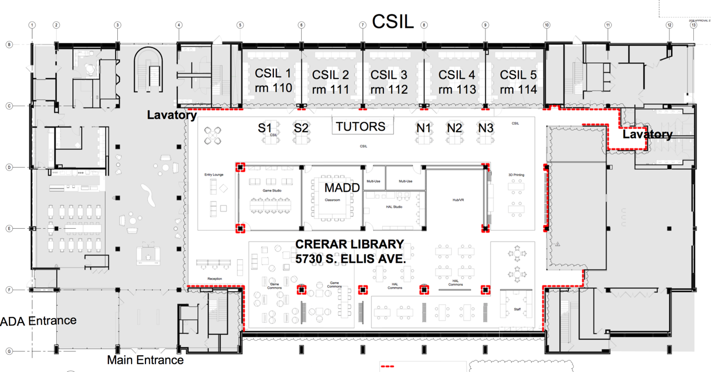

# Intro to CSIL

CSIL, or the "Computer Science Instructional Laboratory", is located on the first floor of the John Crerar Library. Home to a multitude of machines and services, CSIL and its staff exist to increase the accessibility to technology for all University of Chicago students, faculty, and affiliates. 

## Objectives

This minicourse will explain: 

1. Layout of CSIL
2. The CSIL Tutors
3. Lab Policies and Etiquette
4. The CSIL Website
5. How to: Use the Lab Machines
6. How to: Equipment Loans

This course should take approximately 30 minutes.

## Layout of CSIL

Locations of Interest

- The Tutor Desk
- CSIL Labs 1-5
- Kiosks
- Bathrooms
- Entrances and emergency exits
- ADA desks and entrances
- Fire alarm, extinguisher
- MADD = Media Arts Data and Design

#### Kiosks

Monitor displays that convey the following information:

- Lab Reservation schedules
- Tutors on Duty
- Lab announcements (eg. special closing times/dates, construction notices)
- CS Dept Talk dates, times, and locations

## The CSIL Tutors

The CSIL Tutors are a group of student-workers headed by Bill Sterner. They are your go-to resource for any CSIL related questions or concerns. During lab hours, at least one should *always* be present at the CSIL tutor desk. Their responsbilities include, but are not limited to:

- Opening and Closing the labs
- Cleaning the lab desks and machines
- Ensuring machine accessibility
- Loan out equipment 
- Stocking whiteboards
- Taking down or putting up the Hufcor Walls
- Resolving lab projector issues
- Gathering lab usage statistics
- Installing desired software onto the Macs
- Running Mac images with nightly revs
- Maintaining lab servers and backups

CSIL Tutors are **not** required to aid lab users with their programming assignments beyond helping them to have their needed software installed. That said, almost all of the tutors have some background in computer science. If they're familiar with the work and asked nicely enough, they are often willing to help.

### What we can't/don't do

- Increase your Linux machine quotas (but we can request it for you)
- Manage your cs or uchicago accounts
- Manage anything in the basement, 2nd, or 3rd floors of Crerar
- Maintain the campus network and wifi
- Library loans and returns
- Open or close the labs earlier/later without prior approval
- Printing (**printers are in the basement!**)

## Lab Policies and Etiquette

Lab policies are those rules which one's failure to follow could have them removed from the labs. Lab Etiquette are those  guidelines which one's failure to follow will result in anything from security threats to decreased machine lifespan to disgruntled neighbors.

If there's ever an issue or question, don't ever hesitate to reach out to a Tutor.

#### Lab Policies

- Computers must be yielded to other users in this priority order:
  1. Users with a lab reservation
  2. Computer Science students
  3. Users doing academic work
  4. All other users
- A computer left unattended for 15 min is free to others.
- Do **not** attempt to fix computer issues yourself; get a Tutor.
- Do **not** unplug any hardware.
- Do **not** touch the Hufcor walls or blinds; get a Tutor.
- Let a tutor know if you spill or damage anything.

#### Lab Etiquette

- Talking is allowed, screaming is discouraged.
- Food is allowed, overly loud or smelly foods are an annoyance.
- Log out of or lock your machine anytime you're away from it.
- Clean up after yourself
  1. Erase your whiteboards
  2. Put markers, erasers, and rags back on the whiteboard
  3. Return borrowed items to the Tutor Desk
  4. Put up the screen and turn off the projector
  5. Take all of your belongings with you

## The CSIL Website

The CSIL Website can be found at [csil.cs.uchicago.edu](https://csil.cs.uchicago.edu/) and is your hub for information regarding:

- [Lab Reservation Schedule](https://csil.cs.uchicago.edu/timeschedule.html)
- Minicourses
- Policies
- Services
- Staff Listings

## How to: Use the Lab Machines

1. Set down your belongings
2. Wipe down your keyboard, mouse, and station if needed
  - Stations are only cleaned by tutors twice per week. 
  - Cleaning supplies can be found at the Tutor Desk.
  - Replacement mouse pads available for particularly grimy ones.
3. Login to the machine
  - Linux: use your CNET ID and password. You must be registered with the CS Department or Techstaff to use these.
  - Macs: use your CNET ID and password or username "visitor" with no password.
  - If you're having issues, try another machine or contact a tutor.

## How to: Equipment Loans  

#### Available

- Headphones
- Macbook Chargers
- Assorted Cables (micro usb, lightning, C, hdmi, vga, etc.)
- Assorted Adapters (hdmi-vga, lightning-ethernet, etc.)

#### Policies

- If you lose it or break it, you buy it.
- You are responsible for ensuring an item works upon withdrawal.
- Your ID will be kept by a Tutor while you've borrowed an item.
- Equipment may not be taken out of the Crerar building.

#### Checking out

1. Go to the Tutor Desk and ask a tutor to check out an item
2. Fill out your information on the iPad (the item code can be found on the item itself)
3. Hand your ID over to the tutor. 

#### Returning

1. Go to the Tutor Desk and say you'd like to return your item
2. Fill our your information on the iPad
3. Retrieve your ID from a tutor

## How to: Lab Reservations

Labs reservations may only be made by UChicago students, faculty, or affiliates.  
Reservations can only be approved by Dr. Bill Sterner (*bill@uchicago.edu*).  
Reservations for a lab can be made for any of the following reasons:

- Class lab session (approved by University prior to the quarter)
- Office Hours
- Minicourses (tutor-led)
- UChicago-affiliated event
- Specially approved by Bill
